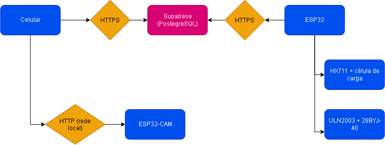

# Alimentador Automático IoT para Pets

Sistema completo de alimentação automatizada para pets de porte médio, com
controle e monitoramento remoto, dosagem em malha fechada e análise de padrões
de consumo.


** PAIC -  59635** — Universidade do Estado do Amazonas
Engenharia de Controle e Automação
Orientação: Prof. Dr. Almir Kimura Júnior

---

## O que o sistema faz

- Libera a porção certa **pesando o que cai na tigela**, em vez de contar passos
  do motor às cegas — o que corrige variação de densidade da ração e detecta
  entupimento do dosador.
- Executa os agendamentos **localmente**, no relógio da própria placa, sem
  depender do celular estar aberto nem da internet estar de pé.
- Mede **quanto o animal realmente comeu**, pela queda do peso na tigela.
- Permite alimentar à distância a partir do aplicativo, de qualquer lugar.
- Agrupa a rotina alimentar (K-means) e sinaliza desvios de consumo (Z-score).

## Arquitetura



A ESP32 fica atrás de NAT e não aceita conexão de entrada. Por isso o aplicativo
não fala direto com ela: ele **insere um comando numa fila** no banco, e a placa
busca essa fila no próprio ritmo. A fila tem reivindicação atômica (um comando
nunca é entregue duas vezes, então o animal não recebe porção dobrada) e
validade de 2 minutos (um comando atrasado expira em vez de despejar ração
quando o Wi-Fi volta de uma queda longa).

## Organização do repositório

```
├── DATASET.md                  ← conjunto de dados: origem, números, limitações
├── supabase/migrations/        ← esquema, RLS, funções, Realtime e carga do dataset
├── firmware/
│   └── alimentador_esp32/      ← firmware da ESP32 principal (Arduino IDE)
├── app/                        ← arquivos alterados do aplicativo
├── analise/                    ← gerador do dataset e pipeline K-means / Z-score
│   ├── gerar_dataset.py
│   ├── pipeline_analise.py
│   ├── dados/
│   └── resultados/
└── docs/
    ├── VERIFICACAO.md                  ← como conferir tudo isto sem falar comigo
    ├── roteiro-bancada.md              ← comece por aqui
    ├── etapa-A-backend.md
    ├── etapa-B-pinagem-e-firmware.md
    ├── etapa-D-app.md
    └── samsung-dataset-registration.md
```

## Componentes

| Camada | Tecnologia |
|---|---|
| Hardware | ESP32 DevKit, célula de carga + HX711, 28BYJ-48 + ULN2003, ESP32-CAM, estrutura impressa em 3D |
| Firmware | C++ / Arduino IDE |
| Backend | Supabase (PostgreSQL, RLS, Realtime, Storage) |
| Aplicativo | React + TypeScript + Tailwind + shadcn/ui, PWA mobile-first, em pt-BR |
| Análise | Python, scikit-learn (K-means e Z-score) |

## Como começar

**Leia [`docs/roteiro-bancada.md`](docs/roteiro-bancada.md).** Ele traz a ordem
correta, em fases, do zero até o alimentador funcionando. A ordem importa: o
banco vem antes da fiação, porque o firmware precisa das credenciais para
compilar.

Resumo das fases: criar o projeto no Supabase e aplicar as migrations → montar a
fiação → gravar o firmware → calibrar a célula de carga → testar ponta a ponta.

## Pinagem

| Componente | Pino | GPIO |
|---|---|---|
| HX711 | DT / SCK | 18 / 19 |
| HX711 | VCC | **3V3** (não 5 V — a ESP32 não tolera 5 V na entrada) |
| ULN2003 | IN1–IN4 | 32, 33, 25, 26 |
| ULN2003 | VCC | 5 V do step-down (não do pino da ESP32) |
| LED de status | — | 2 |

Justificativa das escolhas e cuidados de montagem em
[`docs/etapa-B-pinagem-e-firmware.md`](docs/etapa-B-pinagem-e-firmware.md).

## Análise de dados

```bash
cd analise
pip install -r requirements.txt
python gerar_dataset.py --saida dados          # gera o conjunto (semente fixa)
python pipeline_analise.py --dados dados --saida resultados   # K-means e Z-score
python gerar_sql_carga.py                      # gera as migrations 0006 a 0008
```

As migrations `0006` a `0008` carregam o conjunto e os resultados da análise no
banco. São geradas a partir dos próprios CSVs, então a carga é reprodutível e
versionada — não há importação manual em lugar nenhum.

O conjunto de dados atual é **sintético**, criado para validação técnica dos
algoritmos. Origem, números, metodologia e limitações estão em
[`DATASET.md`](DATASET.md). O aplicativo exibe o aviso *"Dados simulados — em
validação técnica"* enquanto for esse o caso, e o aviso é acionado pela coluna
`source` do banco, não por texto fixo na tela: quando a coleta real substituir o
conjunto, ele desaparece sozinho.

## Verificação independente

Todas as afirmações deste repositório são conferíveis por terceiros, sem acesso a
nenhuma conta e sem falar com os autores: os dados são regeráveis a partir do
script, os números da documentação saem do pipeline, e o banco é populado por
migrations versionadas. A verificação roda sozinha a cada envio de código, na
infraestrutura do GitHub — o log fica público na aba **Actions**.

Para conferir na própria máquina:

```bash
cd analise && pip install -r requirements.txt && python verificar.py
```

O passo a passo completo, incluindo como subir o banco populado do zero, está em
[`docs/VERIFICACAO.md`](docs/VERIFICACAO.md).

## Segurança

- Credenciais ficam em `.env` (aplicativo) e `secrets.h` (firmware), ambos no
  `.gitignore`. Os modelos versionados são `.env.example` e `secrets.example.h`.
- O firmware não escreve direto em nenhuma tabela: toda escrita passa por função
  `SECURITY DEFINER` que exige o cabeçalho `X-Device-Token`.
- A chave `service_role` do Supabase não aparece em nenhum arquivo do projeto.

## Estado atual

| Etapa | Situação |
|---|---|
| Backend (Supabase) | concluído |
| Firmware da ESP32 principal | concluído |
| Aplicativo integrado | concluído |
| Análise (K-means / Z-score) | concluído |
| Firmware da ESP32-CAM | pendente |
| Coleta de dados reais | pendente |

## Licença

Código sob MIT. Conjunto de dados sob CC BY 4.0.
**Confirme as licenças com o orientador e com a instituição antes de publicar.**
